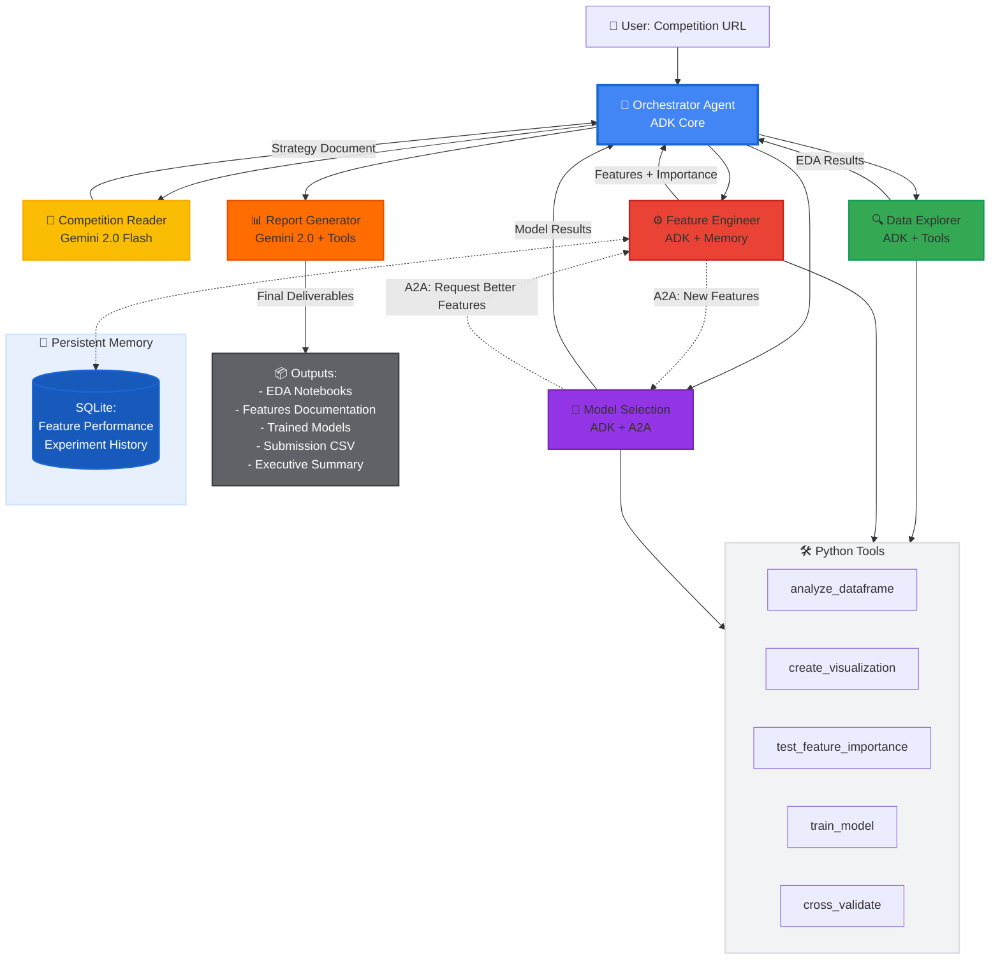

## Architecture Diagram

### System Flow:
1. **User Input** → Competition URL or dataset
2. **Orchestrator** coordinates all agents via ADK
3. **Competition Reader** (Gemini) → Extracts problem requirements
4. **Data Explorer** → Generates EDA with tools
5. **Feature Engineer** → Creates features (stores in memory)
6. **Model Selection** → Trains models, requests features via A2A
7. **Report Generator** (Gemini) → Synthesizes outputs
8. **Final Deliverables** → Notebooks, models, submission

### Key Components:

**Agent Communication:**
- Solid arrows (→): Sequential workflow
- Dotted arrows (⇢): A2A protocol (async communication)

**Technology Stack:**
- 🎯 ADK Core: Multi-agent orchestration
- 🤖 Gemini 2.0: Natural language processing
- 🛠️ Python Tools: Deterministic execution
- 💾 SQLite: Persistent memory

**Agent Specialization:**
- 📖 Competition Reader: NLU for requirements
- 🔍 Data Explorer: Statistical analysis
- ⚙️ Feature Engineer: Feature creation + learning
- 🤖 Model Selection: ML training + A2A requests
- 📊 Report Generator: Human-readable synthesis
